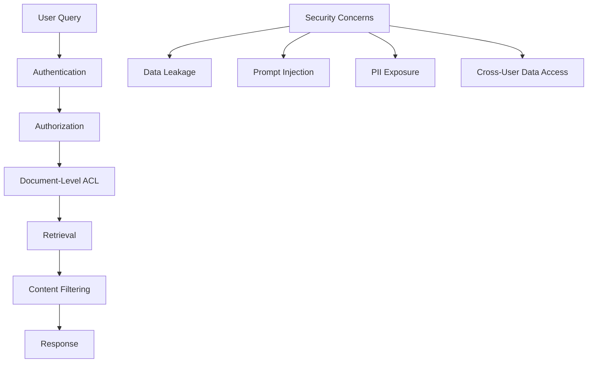
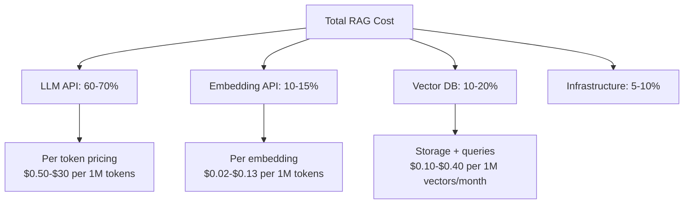
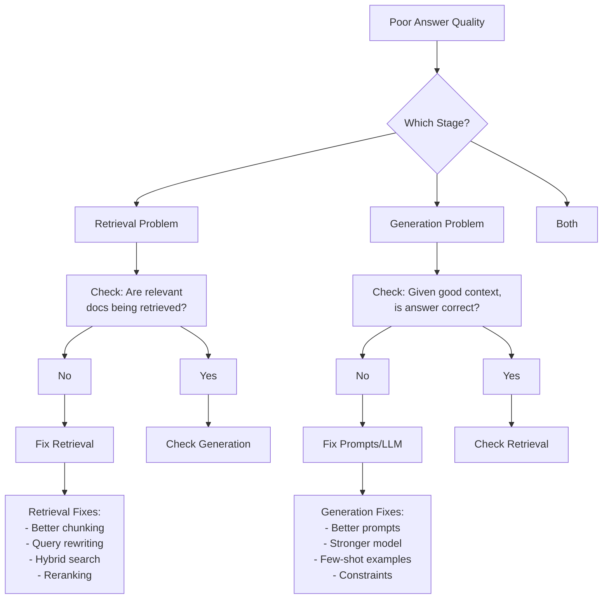

# RAG & LangChain Interview Questions - Part 2 (Questions 11-20)

**Advanced Topics for Experienced Engineers**

---

## Question 11: How do you implement security and access control in RAG systems?

**Answer:**

**Security Layers:**



**1. Document-Level Access Control**

```python
class SecureRAG:
    def __init__(self, vectorstore, acl_manager):
        self.vectorstore = vectorstore
        self.acl_manager = acl_manager
    
    def query(self, question, user_id, user_roles):
        # Retrieve documents
        all_docs = self.vectorstore.similarity_search(question, k=20)
        
        # Filter by ACL
        permitted_docs = [
            doc for doc in all_docs
            if self.acl_manager.can_access(user_id, user_roles, doc)
        ]
        
        if not permitted_docs:
            return "No accessible documents found for your query."
        
        # Generate answer only from permitted docs
        answer = self.generate_answer(question, permitted_docs[:5])
        
        return answer

class ACLManager:
    def can_access(self, user_id, user_roles, document):
        """Check if user can access document"""
        doc_metadata = document.metadata
        
        # Check access level
        required_level = doc_metadata.get("access_level", "public")
        user_clearance = self._get_user_clearance(user_id)
        
        if not self._has_clearance(user_clearance, required_level):
            return False
        
        # Check role requirements
        required_roles = doc_metadata.get("required_roles", [])
        if required_roles and not any(role in user_roles for role in required_roles):
            return False
        
        # Check explicit allow/deny lists
        allowed_users = doc_metadata.get("allowed_users", [])
        denied_users = doc_metadata.get("denied_users", [])
        
        if denied_users and user_id in denied_users:
            return False
        
        if allowed_users and user_id not in allowed_users:
            return False
        
        # Check department/group
        user_dept = self._get_user_department(user_id)
        doc_dept = doc_metadata.get("department")
        
        if doc_dept and user_dept != doc_dept:
            return False
        
        return True
```

**2. Metadata-Based Filtering (Efficient)**

```python
# Add ACL metadata during indexing
for doc in documents:
    doc.metadata.update({
        "access_level": "internal",  # public, internal, confidential, secret
        "department": "engineering",
        "required_roles": ["employee", "contractor"],
        "allowed_users": ["user_123", "user_456"],  # Optional whitelist
        "denied_users": [],  # Optional blacklist
        "data_classification": "sensitive"
    })

# Retrieval with metadata filtering (pushed to vector DB)
retriever = vectorstore.as_retriever(
    search_kwargs={
        "k": 5,
        "filter": {
            "$and": [
                {"department": user_department},
                {"access_level": {"$in": user_clearance_levels}}
            ]
        }
    }
)
# More efficient: filtering happens in DB, not post-processing
```

**3. Input Validation & Prompt Injection Prevention**

```python
class SecureQueryProcessor:
    def sanitize_query(self, query: str) -> str:
        """Prevent prompt injection"""
        
        # Length limit
        if len(query) > 1000:
            raise ValueError("Query too long")
        
        # Block common injection patterns
        injection_patterns = [
            r"ignore previous instructions",
            r"disregard all",
            r"system prompt",
            r"you are now",
            r"\[INST\]",  # Llama prompt format
            r"<\|im_start\|>",  # ChatML format
        ]
        
        for pattern in injection_patterns:
            if re.search(pattern, query, re.IGNORECASE):
                raise ValueError("Potential prompt injection detected")
        
        # Remove control characters
        query = "".join(char for char in query if char.isprintable())
        
        return query.strip()
    
    def validate_metadata_filters(self, filters: dict, user_roles: list):
        """Prevent filter manipulation"""
        
        # Users can't set their own access_level
        if "access_level" in filters:
            raise ValueError("Cannot specify access_level filter")
        
        # Whitelist allowed filter keys
        allowed_keys = {"category", "date_range", "document_type"}
        if not set(filters.keys()).issubset(allowed_keys):
            raise ValueError("Invalid filter keys")
        
        return filters
```

**4. Output Filtering & PII Redaction**

```python
import re
from presidio_analyzer import AnalyzerEngine
from presidio_anonymizer import AnonymizerEngine

class OutputFilter:
    def __init__(self):
        self.analyzer = AnalyzerEngine()
        self.anonymizer = AnonymizerEngine()
    
    def filter_pii(self, text: str) -> str:
        """Remove personally identifiable information"""
        
        # Detect PII
        results = self.analyzer.analyze(
            text=text,
            language='en',
            entities=["PHONE_NUMBER", "EMAIL_ADDRESS", "CREDIT_CARD", "SSN"]
        )
        
        # Anonymize
        anonymized = self.anonymizer.anonymize(text=text, analyzer_results=results)
        
        return anonymized.text
    
    def filter_sensitive_patterns(self, text: str) -> str:
        """Remove common sensitive patterns"""
        
        # Credit card numbers
        text = re.sub(r'\b\d{4}[- ]?\d{4}[- ]?\d{4}[- ]?\d{4}\b', '[REDACTED]', text)
        
        # Social security numbers
        text = re.sub(r'\b\d{3}-\d{2}-\d{4}\b', '[REDACTED]', text)
        
        # API keys/tokens (common patterns)
        text = re.sub(r'[A-Za-z0-9]{32,}', '[REDACTED]', text)
        
        return text
    
    def check_confidentiality(self, text: str, source_docs: list) -> str:
        """Ensure answer doesn't leak confidential info"""
        
        # Get highest classification from source docs
        classifications = [
            doc.metadata.get("data_classification", "public")
            for doc in source_docs
        ]
        
        highest = max(classifications, key=lambda x: 
                     ["public", "internal", "confidential", "secret"].index(x))
        
        # Add classification warning
        if highest != "public":
            text = f"[{highest.upper()}] {text}"
        
        return text

# Usage in RAG
output_filter = OutputFilter()

def secure_query(question, user_id):
    # Generate answer
    answer = rag.query(question)
    
    # Filter PII
    answer = output_filter.filter_pii(answer)
    
    # Filter sensitive patterns
    answer = output_filter.filter_sensitive_patterns(answer)
    
    # Add classification marking
    answer = output_filter.check_confidentiality(answer, source_docs)
    
    # Audit log
    audit_log.record(user_id, question, answer, source_docs)
    
    return answer
```

**5. Audit Logging**

```python
import logging
from datetime import datetime

class AuditLogger:
    def __init__(self, db_connection):
        self.db = db_connection
        self.logger = logging.getLogger("rag_audit")
    
    def log_query(self, user_id, query, results, metadata=None):
        """Log every query for compliance"""
        
        entry = {
            "timestamp": datetime.now().isoformat(),
            "user_id": user_id,
            "query": query,
            "num_results": len(results),
            "document_ids": [doc.metadata["id"] for doc in results],
            "access_granted": True,
            "metadata": metadata or {}
        }
        
        # Store in database
        self.db.audit_logs.insert_one(entry)
        
        # Also log to file
        self.logger.info(f"User {user_id} queried: {query}")
    
    def log_access_denied(self, user_id, query, reason):
        """Log access denials"""
        
        entry = {
            "timestamp": datetime.now().isoformat(),
            "user_id": user_id,
            "query": query,
            "access_granted": False,
            "denial_reason": reason
        }
        
        self.db.audit_logs.insert_one(entry)
        self.logger.warning(f"Access denied for user {user_id}: {reason}")
```

**6. Row-Level Security (Database RAG)**

```python
from sqlalchemy import create_engine, text

class SecureDBRAG:
    def __init__(self, db_uri, user_context):
        self.engine = create_engine(db_uri)
        self.user_context = user_context
    
    def query_with_rls(self, natural_language_query):
        """Query database with row-level security"""
        
        # Convert NL to SQL
        sql_query = self.nl_to_sql(natural_language_query)
        
        # Add RLS filter
        secure_sql = self._add_rls_filter(sql_query, self.user_context)
        
        # Execute
        with self.engine.connect() as conn:
            # Set user context for RLS policies
            conn.execute(text(f"SET app.user_id = '{self.user_context['user_id']}'"))
            conn.execute(text(f"SET app.user_role = '{self.user_context['role']}'"))
            
            results = conn.execute(text(secure_sql))
        
        return results.fetchall()
    
    def _add_rls_filter(self, sql, user_context):
        """Add row-level security filters to SQL"""
        
        # Example: Add WHERE clause to restrict rows
        user_dept = user_context.get("department")
        
        if "WHERE" in sql.upper():
            sql += f" AND department = '{user_dept}'"
        else:
            sql += f" WHERE department = '{user_dept}'"
        
        return sql
```

**Security Checklist:**

- [ ] Document-level access control (metadata-based)
- [ ] Input validation (query sanitization, length limits)
- [ ] Prompt injection prevention
- [ ] Output filtering (PII redaction)
- [ ] Audit logging (all queries and access denials)
- [ ] Rate limiting (prevent abuse)
- [ ] Encryption at rest and in transit
- [ ] Regular security audits
- [ ] GDPR/compliance tooling (right to be forgotten)

---

## Question 12: How do you optimize costs in production RAG?

**Answer:**

**Cost Breakdown (Typical):**



**Optimization Strategies:**

**1. Semantic Caching (70-90% LLM cost reduction)**

```python
import hashlib
from langchain.cache import RedisSemanticCache

class SemanticCache:
    def __init__(self, redis_client, embeddings, threshold=0.95):
        self.redis = redis_client
        self.embeddings = embeddings
        self.threshold = threshold
    
    async def get(self, query: str):
        """Check if similar query was answered recently"""
        
        # Embed query
        query_embedding = await self.embeddings.aembed_query(query)
        
        # Search cache for similar queries
        cached_queries = self.redis.ft().search(
            Query(query_embedding).return_field("answer").dialect(2),
            {"K": 1, "EF_RUNTIME": 10}
        )
        
        if cached_queries and cached_queries[0].score > self.threshold:
            # Cache hit!
            return cached_queries[0].answer
        
        return None
    
    async def set(self, query: str, answer: str, ttl=3600):
        """Cache query-answer pair"""
        
        query_embedding = await self.embeddings.aembed_query(query)
        
        cache_key = hashlib.md5(query.encode()).hexdigest()
        
        self.redis.hset(cache_key, mapping={
            "query": query,
            "answer": answer,
            "embedding": query_embedding.tobytes(),
            "timestamp": datetime.now().isoformat()
        })
        
        self.redis.expire(cache_key, ttl)

# Usage
cache = SemanticCache(redis_client, embeddings)

async def query_with_cache(question):
    # Check cache first
    cached = await cache.get(question)
    if cached:
        return cached  # Save LLM API call!
    
    # Cache miss: process normally
    answer = await rag.query(question)
    
    # Cache for future
    await cache.set(question, answer)
    
    return answer

# Example:
# Query 1: "How do I reset my password?" → Cache miss, costs $0.01
# Query 2: "How can I reset my password?" → Cache HIT (95% similar), costs $0
# Query 3: "Password reset instructions?" → Cache HIT (92% similar), costs $0
# 
# Savings: 66% reduction in LLM costs
```

**2. Smart Model Selection**

```python
class ModelRouter:
    """Route queries to appropriate model based on complexity"""
    
    def __init__(self):
        self.simple_model = "gpt-3.5-turbo"  # $0.50 per 1M tokens
        self.complex_model = "gpt-4"          # $30 per 1M tokens
    
    def classify_complexity(self, query: str, context: str) -> str:
        """Determine if query needs powerful model"""
        
        # Simple heuristics
        simple_indicators = [
            len(query.split()) < 10,  # Short query
            any(word in query.lower() for word in ["what is", "define", "explain"]),
            len(context) < 500  # Small context
        ]
        
        complex_indicators = [
            "compare" in query.lower(),
            "analyze" in query.lower(),
            len(context) > 2000,
            "?" in query and query.count("?") > 1  # Multi-part question
        ]
        
        if sum(complex_indicators) >= 2:
            return self.complex_model
        elif sum(simple_indicators) >= 2:
            return self.simple_model
        else:
            # Default to cheaper model
            return self.simple_model
    
    def query(self, question, context):
        model = self.classify_complexity(question, context)
        
        if model == self.simple_model:
            llm = ChatOpenAI(model="gpt-3.5-turbo", temperature=0)
        else:
            llm = ChatOpenAI(model="gpt-4", temperature=0)
        
        return llm.invoke(f"Question: {question}\nContext: {context}")

# Result: 70% of queries use GPT-3.5 instead of GPT-4
# Savings: ~60% reduction in LLM costs
```

**3. Context Optimization**

```python
class ContextOptimizer:
    """Reduce tokens sent to LLM"""
    
    def compress_context(self, query: str, documents: list, max_tokens=2000):
        """Use LLM to extract only relevant parts"""
        
        compressor = LLMChainExtractor.from_llm(llm)
        
        compressed_docs = compressor.compress_documents(
            documents=documents,
            query=query
        )
        
        # Can reduce context from 5000 tokens to 2000 tokens
        # 60% cost reduction on this component
        return compressed_docs
    
    def smart_chunking(self, documents: list, query: str):
        """Retrieve smaller initial chunks, expand if needed"""
        
        # Phase 1: Retrieve small chunks (400 tokens each)
        small_chunks = self.retriever_small.get_relevant_documents(query)
        
        # Phase 2: Expand to parent chunks only if needed
        if self.needs_more_context(small_chunks, query):
            return self.expand_to_parents(small_chunks)
        
        return small_chunks
```

**4. Batching**

```python
class BatchProcessor:
    """Batch embeddings for cost efficiency"""
    
    async def embed_documents_batch(self, documents: list, batch_size=100):
        """Batch embedding generation"""
        
        results = []
        
        for i in range(0, len(documents), batch_size):
            batch = documents[i:i+batch_size]
            
            # Single API call for 100 documents (cheaper than 100 individual calls)
            embeddings = await self.embedding_model.aembed_documents(
                [doc.page_content for doc in batch]
            )
            
            results.extend(embeddings)
        
        return results
```

**5. Cheaper Embedding Models**

```python
# Production embedding model comparison

embeddings_expensive = AzureOpenAIEmbeddings(
    model="text-embedding-3-large",  # $0.13 per 1M tokens
    dimensions=3072
)

embeddings_cheap = AzureOpenAIEmbeddings(
    model="text-embedding-3-small",  # $0.02 per 1M tokens (6.5x cheaper)
    dimensions=1536
)

# OR use open-source (free)
embeddings_free = HuggingFaceEmbeddings(
    model_name="BAAI/bge-small-en-v1.5"  # Free, self-hosted
)

# Quality vs Cost trade-off:
# large: 100% quality, $0.13 per 1M
# small: 97% quality, $0.02 per 1M  ← Recommended for most use cases
# free:  90% quality, $0.00 (+ infrastructure cost)
```

**6. Vector Database Optimization**

```python
# Self-host Qdrant instead of Pinecone

# Pinecone (managed):
# - Storage: $0.40 per 1M vectors/month
# - Queries: $0.20 per 1M queries
# Total for 10M vectors, 1M queries/month: ~$4,200/month

# Qdrant (self-hosted on AWS):
# - EC2 instance (r6g.xlarge): $150/month
# - Storage (500GB EBS): $50/month
# Total: ~$200/month

# Savings: 95% reduction in vector DB costs
```

**7. Rate Limiting & Quotas**

```python
from slowapi import Limiter
from slowapi.util import get_remote_address

limiter = Limiter(key_func=get_remote_address)

@app.post("/query")
@limiter.limit("10/minute")  # Prevent abuse
async def query_endpoint(request):
    # Also implement user quotas
    user_quota = get_user_quota(request.user_id)
    
    if user_quota.queries_this_month >= user_quota.monthly_limit:
        raise HTTPException(429, "Monthly quota exceeded")
    
    # Process query
    result = await rag.query(request.question)
    
    # Track usage
    user_quota.increment()
    
    return result
```

**Cost Optimization Summary:**

| Strategy | Potential Savings | Effort | Impact |
|----------|------------------|--------|--------|
| **Semantic Caching** | 70-90% | Medium | Very High |
| **Model Selection** | 50-70% | Low | High |
| **Context Compression** | 30-60% | Medium | High |
| **Cheaper Embeddings** | 85% (large→small) | Low | Medium |
| **Self-host Vector DB** | 90% | High | High |
| **Batching** | 20-30% | Low | Medium |
| **Rate Limiting** | 10-30% | Low | Medium |

**Real-World Example:**

```python
# Before optimization: $10,000/month for 100K queries
costs_before = {
    "llm": 7000,        # GPT-4 for everything
    "embeddings": 1000,  # text-embedding-3-large
    "vector_db": 2000    # Pinecone
}

# After optimization: $1,500/month
costs_after = {
    "llm": 800,         # 80% cache hit + GPT-3.5 for simple queries
    "embeddings": 150,   # text-embedding-3-small + batch processing
    "vector_db": 200,    # Self-hosted Qdrant
    "cache_infra": 100,  # Redis for caching
    "compute": 250       # Additional servers
}

# Total savings: 85% cost reduction ($8,500/month saved)
```

---

## Question 13: How would you debug a RAG system that's giving poor answers?

**Answer:**

**Debugging Framework:**



**1. Isolate the Problem: Retrieval vs Generation**

```python
class RAGDebugger:
    def __init__(self, rag_system):
        self.rag = rag_system
    
    def debug_query(self, question, expected_answer=None):
        """Comprehensive debugging"""
        
        print(f"\n{'='*80}")
        print(f"DEBUGGING QUERY: {question}")
        print(f"{'='*80}\n")
        
        # Step 1: Check retrieval
        print("STEP 1: RETRIEVAL CHECK")
        print("-" * 80)
        
        retrieved_docs = self.rag.retriever.get_relevant_documents(question)
        
        print(f"Number of docs retrieved: {len(retrieved_docs)}")
        print(f"\nTop 3 retrieved documents:")
        
        for i, doc in enumerate(retrieved_docs[:3], 1):
            print(f"\n[Doc {i}] Score: {doc.metadata.get('score', 'N/A')}")
            print(f"Source: {doc.metadata.get('source', 'Unknown')}")
            print(f"Content preview: {doc.page_content[:200]}...")
        
        # Manual assessment
        contains_answer = input("\nDo these docs contain the answer? (y/n): ")
        
        if contains_answer.lower() == 'n':
            print("\n🔴 RETRIEVAL PROBLEM DETECTED")
            self.diagnose_retrieval(question, retrieved_docs)
            return
        
        # Step 2: Check generation
        print("\n" + "="*80)
        print("STEP 2: GENERATION CHECK")
        print("-" * 80)
        
        # Test with perfect context (manual)
        perfect_context = input("\nProvide perfect context (or press Enter to use retrieved): ")
        
        if not perfect_context:
            context = "\n\n".join([doc.page_content for doc in retrieved_docs[:3]])
        else:
            context = perfect_context
        
        generated_answer = self.rag.llm.invoke(f"""
        Question: {question}
        Context: {context}
        
        Provide a detailed answer based solely on the context.
        """)
        
        print(f"\nGenerated answer:\n{generated_answer}")
        
        if expected_answer:
            print(f"\nExpected answer:\n{expected_answer}")
        
        is_good = input("\nIs this a good answer? (y/n): ")
        
        if is_good.lower() == 'n':
            print("\n🔴 GENERATION PROBLEM DETECTED")
            self.diagnose_generation(question, context, generated_answer)
        else:
            print("\n🟢 System working correctly!")
    
    def diagnose_retrieval(self, question, retrieved_docs):
        """Diagnose retrieval issues"""
        
        print("\nRETRIEVAL DIAGNOSTICS:")
        print("-" * 80)
        
        # 1. Check query embedding
        query_embedding = self.rag.embeddings.embed_query(question)
        print(f"1. Query embedded successfully: {len(query_embedding)} dimensions")
        
        # 2. Check if relevant docs exist
        print("\n2. Checking if relevant documents exist in index...")
        
        expected_keywords = input("   What keywords should appear in results? ").split()
        
        # Search for each keyword
        for keyword in expected_keywords:
            keyword_results = self.rag.vectorstore.similarity_search(keyword, k=1)
            if keyword_results:
                print(f"   ✓ Found docs for '{keyword}'")
            else:
                print(f"   ✗ No docs found for '{keyword}' - may not be indexed!")
        
        # 3. Check retrieval method
        print(f"\n3. Current retrieval method: {self.rag.retriever.__class__.__name__}")
        
        # 4. Test alternative retrievals
        print("\n4. Testing alternative retrieval strategies:")
        
        # Try hybrid search
        from langchain.retrievers import EnsembleRetriever
        bm25_retriever = BM25Retriever.from_documents(self.rag.documents)
        hybrid = EnsembleRetriever(
            retrievers=[self.rag.retriever, bm25_retriever],
            weights=[0.5, 0.5]
        )
        hybrid_results = hybrid.get_relevant_documents(question)
        
        print(f"   Hybrid search returned {len(hybrid_results)} docs")
        print(f"   Top result: {hybrid_results[0].page_content[:100]}...")
        
        better = input("   Are hybrid results better? (y/n): ")
        
        if better.lower() == 'y':
            print("\n💡 RECOMMENDATION: Switch to hybrid retrieval")
        
        # 5. Test with query rewriting
        print("\n5. Testing query rewriting:")
        
        rewritten = self.rag.llm.invoke(f"""
        Rewrite this question to be more specific and searchable:
        {question}
        
        Return only the rewritten question.
        """)
        
        print(f"   Rewritten query: {rewritten}")
        
        rewritten_results = self.rag.retriever.get_relevant_documents(rewritten)
        print(f"   Retrieved {len(rewritten_results)} docs")
        
        better = input("   Are results better? (y/n): ")
        
        if better.lower() == 'y':
            print("\n💡 RECOMMENDATION: Add query rewriting step")
        
        # 6. Check chunk size
        print(f"\n6. Current chunk size: {self.estimate_chunk_size(retrieved_docs)}")
        print("   If chunks are too small: Missing context")
        print("   If chunks are too large: Diluted relevance")
        
        # Summary
        print("\n" + "="*80)
        print("RETRIEVAL FIXES TO TRY:")
        print("="*80)
        print("1. Add hybrid search (vector + BM25)")
        print("2. Implement query rewriting/expansion")
        print("3. Adjust chunk size (currently ~{} chars)".format(
            self.estimate_chunk_size(retrieved_docs)
        ))
        print("4. Add reranking step (Cohere, cross-encoder)")
        print("5. Check if documents are properly indexed")
        print("6. Try different embedding model")
    
    def diagnose_generation(self, question, context, generated_answer):
        """Diagnose generation issues"""
        
        print("\nGENERATION DIAGNOSTICS:")
        print("-" * 80)
        
        # 1. Check prompt
        print("1. Current prompt structure:")
        print(self.rag.prompt_template)
        
        # 2. Test with explicit constraints
        print("\n2. Testing with explicit constraints:")
        
        constrained_answer = self.rag.llm.invoke(f"""
        Question: {question}
        Context: {context}
        
        Instructions:
        1. Answer ONLY based on the context provided
        2. If the context doesn't contain the answer, say "The provided context doesn't contain this information"
        3. Cite specific parts of the context in your answer
        4. Be concise and direct
        
        Answer:
        """)
        
        print(f"Constrained answer:\n{constrained_answer}")
        
        better = input("\nIs this better? (y/n): ")
        
        if better.lower() == 'y':
            print("\n💡 RECOMMENDATION: Add explicit constraints to prompt")
        
        # 3. Test with few-shot examples
        print("\n3. Testing with few-shot examples:")
        
        few_shot_answer = self.rag.llm.invoke(f"""
        Here are examples of good answers:
        
        Q: What is the return policy?
        Context: "Items can be returned within 30 days..."
        A: According to the policy, items can be returned within 30 days.
        
        Q: What is the shipping cost?
        Context: "Standard shipping is $5.99 for orders under $50..."
        A: Standard shipping costs $5.99 for orders under $50.
        
        Now answer this:
        Q: {question}
        Context: {context}
        A:
        """)
        
        print(f"Few-shot answer:\n{few_shot_answer}")
        
        better = input("\nIs this better? (y/n): ")
        
        if better.lower() == 'y':
            print("\n💡 RECOMMENDATION: Add few-shot examples to prompt")
        
        # 4. Test with different model
        print(f"\n4. Current model: {self.rag.llm.model_name}")
        print("   Consider trying GPT-4 if using GPT-3.5")
        
        # 5. Check for hallucinations
        print("\n5. Checking for hallucinations:")
        
        verification = self.rag.llm.invoke(f"""
        Question: {question}
        Answer: {generated_answer}
        Context: {context}
        
        Is every claim in the answer supported by the context?
        List any claims that are NOT supported.
        """)
        
        print(f"Verification result:\n{verification}")
        
        # Summary
        print("\n" + "="*80)
        print("GENERATION FIXES TO TRY:")
        print("="*80)
        print("1. Add explicit constraints to prompt")
        print("2. Include few-shot examples")
        print("3. Try more powerful model (GPT-4)")
        print("4. Add verification/self-correction step")
        print("5. Adjust temperature (lower = more focused)")
        print("6. Add chain-of-thought prompting")

# Usage
debugger = RAGDebugger(rag_system)
debugger.debug_query(
    "What is the return policy for electronics?",
    expected_answer="Electronics can be returned within 14 days..."
)
```

**2. Automated Testing Suite**

```python
class RAGTestSuite:
    """Automated tests for regression detection"""
    
    def __init__(self, rag_system, test_cases):
        self.rag = rag_system
        self.test_cases = test_cases  # List of (question, expected_answer, relevant_doc_ids)
    
    def run_tests(self):
        """Run full test suite"""
        
        results = {
            "passed": 0,
            "failed": 0,
            "failures": []
        }
        
        for test in self.test_cases:
            question = test["question"]
            expected = test["expected_answer"]
            relevant_docs = test["relevant_doc_ids"]
            
            # Test retrieval
            retrieved = self.rag.retriever.get_relevant_documents(question)
            retrieved_ids = [doc.metadata["id"] for doc in retrieved]
            
            retrieval_recall = len(set(retrieved_ids[:5]) & set(relevant_docs)) / len(relevant_docs)
            
            # Test generation
            answer = self.rag.query(question)
            
            # Simple similarity check (in production, use better metrics)
            similarity = self.compute_similarity(answer, expected)
            
            # Pass/fail
            if retrieval_recall >= 0.6 and similarity >= 0.7:
                results["passed"] += 1
            else:
                results["failed"] += 1
                results["failures"].append({
                    "question": question,
                    "retrieval_recall": retrieval_recall,
                    "answer_similarity": similarity,
                    "expected": expected,
                    "got": answer
                })
        
        # Report
        print(f"\n{'='*80}")
        print(f"TEST RESULTS: {results['passed']}/{len(self.test_cases)} passed")
        print(f"{'='*80}\n")
        
        if results["failures"]:
            print("FAILURES:")
            for i, failure in enumerate(results["failures"], 1):
                print(f"\n{i}. {failure['question']}")
                print(f"   Retrieval recall: {failure['retrieval_recall']:.2f}")
                print(f"   Answer similarity: {failure['answer_similarity']:.2f}")
        
        return results

# Usage
test_cases = [
    {
        "question": "What is the return policy?",
        "expected_answer": "Items can be returned within 30 days with receipt",
        "relevant_doc_ids": ["doc_123", "doc_456"]
    },
    # ... more test cases
]

test_suite = RAGTestSuite(rag_system, test_cases)
results = test_suite.run_tests()
```

**Common Issues & Fixes:**

| Symptom | Likely Cause | Fix |
|---------|--------------|-----|
| **Wrong docs retrieved** | Poor embeddings, bad chunking | Hybrid search, reranking, better chunking |
| **Right docs, wrong answer** | Bad prompts, weak model | Better prompts, GPT-4, few-shot examples |
| **Generic/vague answers** | Context not used | Add "based on context" constraint |
| **Hallucinations** | No verification | Add faithfulness check, cite sources |
| **Missing information** | Chunk too small | Increase chunk size or use parent-child |
| **Slow responses** | Too many docs, large context | Context compression, fewer docs |

**Debugging Checklist:**

1. ✅ Test retrieval in isolation (are relevant docs retrieved?)
2. ✅ Test generation in isolation (given perfect context, is answer good?)
3. ✅ Check embeddings (is query embedding similar to relevant docs?)
4. ✅ Verify documents are indexed (search for known keywords)
5. ✅ Try alternative retrieval (hybrid, reranking)
6. ✅ Test query rewriting (does rephrasing help?)
7. ✅ Examine prompt (are instructions clear?)
8. ✅ Check for hallucinations (verify claims against context)
9. ✅ Run automated test suite (catch regressions)

---

## Question 14: How would you implement RAG for real-time data (news, stock prices, etc.)?

**Answer:**

**Challenge:** Vector stores contain static indexed data. How to incorporate real-time information?

**Solution Approaches:**

**1. Hybrid: Static RAG + Real-time API**

```mermaid
graph TD
    A[User Query: "What's the latest on Tesla stock?"] --> B{Query Router}
    
    B --> C[Classify: Real-time or Historical?]
    
    C --> D[Real-time Tool]
    C --> E[Static RAG]
    
    D --> F[Stock Price API]
    D --> G[News API]
    D --> H[Weather API]
    
    F --> I[Current: $245.32 +2.3%]
    G --> J[Latest: "Tesla announces..."]
    
    E --> K[Historical context from docs]
    
    I --> L[LLM Synthesis]
    J --> L
    K --> L
    
    L --> M[Comprehensive Answer]
```

**Implementation:**

```python
from langchain.agents import create_openai_tools_agent, Tool
from langchain.tools import BaseTool
import requests

class StockPriceTool(BaseTool):
    """Tool to fetch current stock prices"""
    
    name = "stock_price"
    description = "Get current stock price for a ticker symbol. Input should be ticker (e.g., 'TSLA')"
    
    def _run(self, ticker: str) -> str:
        # Call real-time API
        response = requests.get(
            f"https://api.example.com/stock/{ticker}",
            headers={"Authorization": f"Bearer {API_KEY}"}
        )
        
        data = response.json()
        
        return f"Current price of {ticker}: ${data['price']} ({data['change_percent']:+.2f}%)"

class NewsTool(BaseTool):
    """Tool to fetch latest news"""
    
    name = "latest_news"
    description = "Get latest news articles about a topic. Input should be search query."
    
    def _run(self, query: str) -> str:
        # Call news API (e.g., NewsAPI, Google News)
        response = requests.get(
            "https://newsapi.org/v2/everything",
            params={
                "q": query,
                "apiKey": NEWS_API_KEY,
                "sortBy": "publishedAt",
                "pageSize": 3
            }
        )
        
        articles = response.json()["articles"]
        
        # Format articles
        news_summary = ""
        for article in articles:
            news_summary += f"""
            Title: {article['title']}
            Source: {article['source']['name']}
            Published: {article['publishedAt']}
            Summary: {article['description']}
            ---
            """
        
        return news_summary

class WebSearchTool(BaseTool):
    """Tool for real-time web search"""
    
    name = "web_search"
    description = "Search the web for current information. Use for recent events, current data."
    
    def _run(self, query: str) -> str:
        # Use Serper API, Brave Search, or similar
        # (Already available in Claude's environment)
        pass

# Create RAG with tools
from langchain.tools.retriever import create_retriever_tool

# Static knowledge base
rag_tool = create_retriever_tool(
    retriever=vectorstore.as_retriever(),
    name="knowledge_base",
    description="Search company documentation, historical data, and internal knowledge. Use for non-time-sensitive information."
)

# Combine tools
tools = [
    rag_tool,
    StockPriceTool(),
    NewsTool(),
    WebSearchTool()
]

# Create agent that can use both
from langchain.agents import AgentExecutor

agent = create_openai_tools_agent(
    llm=llm,
    tools=tools,
    prompt=prompt
)

agent_executor = AgentExecutor(
    agent=agent,
    tools=tools,
    verbose=True
)

# Usage
response = agent_executor.invoke({
    "input": "What's the latest on Tesla stock and recent news?"
})

# Agent workflow:
# 1. Decides to use stock_price tool → Gets current price
# 2. Decides to use latest_news tool → Gets recent articles
# 3. (Optional) Uses knowledge_base → Gets historical context
# 4. Synthesizes all information into coherent answer
```

**2. Streaming Data Indexing**

```python
from kafka import KafkaConsumer
import asyncio

class StreamingRAGIndexer:
    """Continuously index real-time data streams"""
    
    def __init__(self, vectorstore, embeddings):
        self.vectorstore = vectorstore
        self.embeddings = embeddings
        self.consumer = KafkaConsumer(
            'news_stream',
            bootstrap_servers=['localhost:9092']
        )
    
    async def start_indexing(self):
        """Continuously consume and index"""
        
        while True:
            for message in self.consumer:
                article = json.loads(message.value)
                
                # Create document
                doc = Document(
                    page_content=article["content"],
                    metadata={
                        "source": "news_stream",
                        "title": article["title"],
                        "published_at": article["published_at"],
                        "freshness": "real-time",
                        "ttl": datetime.now() + timedelta(days=7)
                    }
                )
                
                # Index immediately
                await self.vectorstore.aadd_documents([doc])
                
                # Set expiration (optional)
                await self.schedule_deletion(doc, ttl=7*24*3600)
    
    async def schedule_deletion(self, doc, ttl):
        """Remove stale data"""
        await asyncio.sleep(ttl)
        await self.vectorstore.adelete([doc.metadata["id"]])

# Start background indexer
indexer = StreamingRAGIndexer(vectorstore, embeddings)
asyncio.create_task(indexer.start_indexing())
```

**3. Time-Aware Retrieval**

```python
class TimeAwareRetriever:
    """Boost recent documents in retrieval"""
    
    def __init__(self, vectorstore):
        self.vectorstore = vectorstore
    
    def retrieve_with_recency(self, query, k=5):
        """Retrieve docs with recency boost"""
        
        # Get more candidates
        candidates = self.vectorstore.similarity_search(query, k=k*3)
        
        # Rerank with recency
        scored_docs = []
        for doc in candidates:
            # Base similarity score
            similarity = doc.metadata.get("score", 0.5)
            
            # Recency score
            published = datetime.fromisoformat(doc.metadata.get("published_at"))
            age_days = (datetime.now() - published).days
            
            # Exponential decay: 50% value after 30 days
            recency_score = 0.5 ** (age_days / 30)
            
            # Combined score (60% similarity, 40% recency)
            final_score = 0.6 * similarity + 0.4 * recency_score
            
            scored_docs.append((doc, final_score))
        
        # Sort and return top-k
        scored_docs.sort(key=lambda x: x[1], reverse=True)
        return [doc for doc, score in scored_docs[:k]]
```

**4. Cache Invalidation for Real-Time**

```python
class RealTimeRAGCache:
    """Cache with TTL for real-time data"""
    
    def __init__(self, redis_client):
        self.redis = redis_client
    
    def get(self, query, data_type="general"):
        """Get cached result"""
        
        cache_key = f"{data_type}:{hashlib.md5(query.encode()).hexdigest()}"
        cached = self.redis.get(cache_key)
        
        if cached:
            return json.loads(cached)
        
        return None
    
    def set(self, query, answer, data_type="general"):
        """Cache with appropriate TTL"""
        
        # TTL based on data type
        ttl_map = {
            "static": 7*24*3600,      # 7 days for static docs
            "news": 3600,              # 1 hour for news
            "stock": 300,              # 5 minutes for stock prices
            "weather": 1800,           # 30 minutes for weather
            "sports_live": 30          # 30 seconds for live scores
        }
        
        ttl = ttl_map.get(data_type, 3600)
        
        cache_key = f"{data_type}:{hashlib.md5(query.encode()).hexdigest()}"
        
        self.redis.setex(
            cache_key,
            ttl,
            json.dumps(answer)
        )
```

**5. Hybrid Architecture (Production)**

```python
class HybridRealTimeRAG:
    """Combine static knowledge + real-time data"""
    
    def __init__(self, llm, static_retriever, tools):
        self.llm = llm
        self.static_retriever = static_retriever
        self.tools = tools
        self.cache = RealTimeRAGCache(redis_client)
    
    async def query(self, question):
        # Check cache
        cached = self.cache.get(question, self.classify_data_type(question))
        if cached:
            return cached
        
        # Classify query
        needs_realtime = self.needs_real_time_data(question)
        
        if needs_realtime:
            # Use agent with tools
            answer = await self.query_with_tools(question)
        else:
            # Use static RAG
            answer = await self.query_static(question)
        
        # Cache result
        self.cache.set(question, answer, self.classify_data_type(question))
        
        return answer
    
    def needs_real_time_data(self, question):
        """Determine if query needs real-time data"""
        
        realtime_indicators = [
            "latest", "recent", "current", "now", "today",
            "breaking", "live", "update", "price"
        ]
        
        return any(indicator in question.lower() for indicator in realtime_indicators)
    
    async def query_with_tools(self, question):
        """Use agent for real-time queries"""
        
        agent_executor = AgentExecutor(
            agent=create_openai_tools_agent(self.llm, self.tools, prompt),
            tools=self.tools
        )
        
        result = await agent_executor.ainvoke({"input": question})
        return result["output"]
    
    async def query_static(self, question):
        """Use traditional RAG for static queries"""
        
        docs = self.static_retriever.get_relevant_documents(question)
        context = "\n\n".join([doc.page_content for doc in docs])
        
        answer = await self.llm.ainvoke(f"""
        Question: {question}
        Context: {context}
        Answer:
        """)
        
        return answer

# Usage
hybrid_rag = HybridRealTimeRAG(
    llm=llm,
    static_retriever=vectorstore.as_retriever(),
    tools=[StockPriceTool(), NewsTool(), WebSearchTool()]
)

# Real-time query
await hybrid_rag.query("What's Tesla's current stock price?")
# → Uses StockPriceTool

# Static query
await hybrid_rag.query("Explain Tesla's business model")
# → Uses static RAG

# Hybrid query
await hybrid_rag.query("How has Tesla's stock performed historically and what's the current price?")
# → Uses both static RAG (historical) + StockPriceTool (current)
```

**Best Practices:**

1. **Use Agents**: Let LLM decide when to use real-time tools vs static knowledge
2. **Appropriate Caching**: Different TTLs for different data types
3. **Combine Sources**: Blend static knowledge with real-time data for context
4. **Recency Boosting**: Weight recent documents higher in retrieval
5. **Streaming Indexing**: For high-volume streams, continuously index
6. **Fallback Strategy**: If real-time API fails, use cached or static data

---


