# RAG Architectures & LangChain: Deep Dive

## Table of Contents
1. [RAG Fundamentals](#rag-fundamentals)
2. [RAG Architecture Patterns](#rag-architecture-patterns)
3. [LangChain Deep Dive](#langchain-deep-dive)
4. [Advanced RAG Techniques](#advanced-rag-techniques)
5. [Production Considerations](#production-considerations)
6. [Learning Resources](#learning-resources)

---

## RAG Fundamentals

### What is RAG?

Retrieval-Augmented Generation (RAG) is a pattern that enhances LLM responses by retrieving relevant context from external knowledge sources before generating answers. It addresses the limitations of LLMs regarding knowledge cutoff dates, hallucinations, and domain-specific information.

### Basic RAG Flow

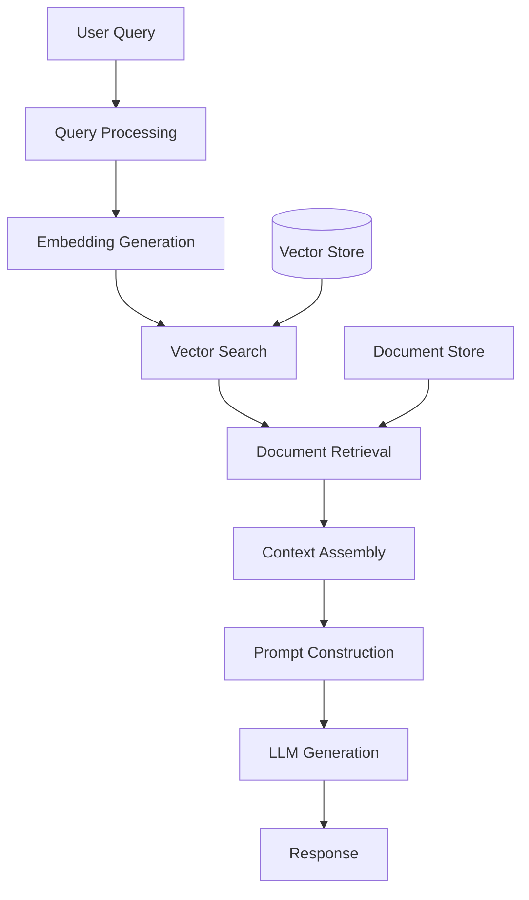

### Core Components

**Indexing Pipeline:**
- Document loading and parsing
- Text chunking/splitting
- Embedding generation
- Vector storage

**Retrieval Pipeline:**
- Query understanding
- Embedding generation
- Similarity search
- Context ranking/filtering

**Generation Pipeline:**
- Prompt engineering
- LLM invocation
- Response synthesis

---

## RAG Architecture Patterns

### 1. Naive RAG (Basic Pattern)

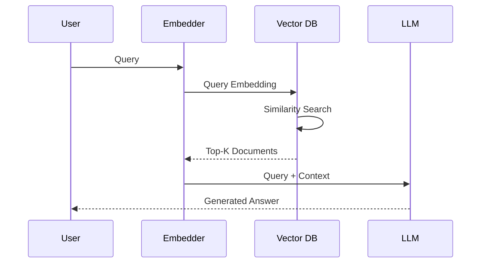

**Characteristics:**
- Single-pass retrieval
- Direct vector similarity
- Simple prompt construction
- Good for straightforward Q&A

**Limitations:**
- No query refinement
- Limited context understanding
- May retrieve irrelevant chunks

### 2. Advanced RAG (Multi-Stage)

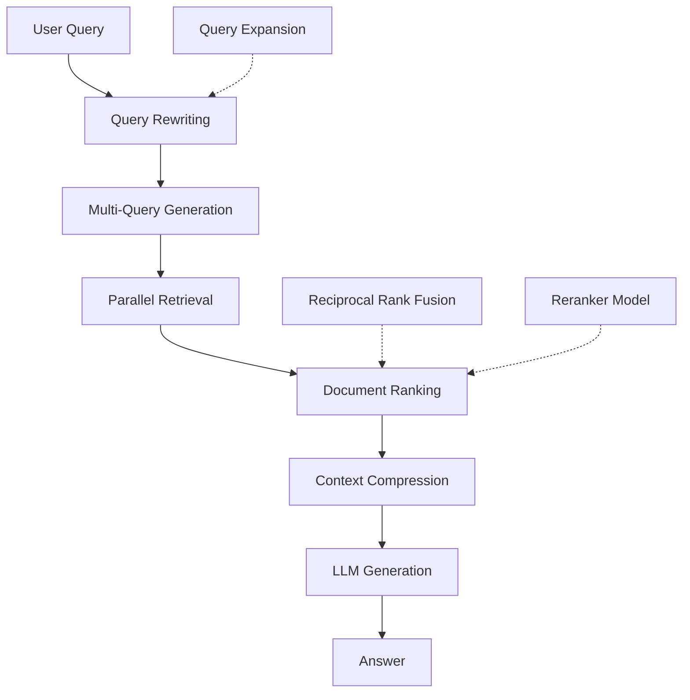

**Key Enhancements:**
- Query transformation and expansion
- Multiple retrieval strategies
- Reranking mechanisms
- Context compression
- Self-reflection and verification

### 3. Agentic RAG (Iterative)

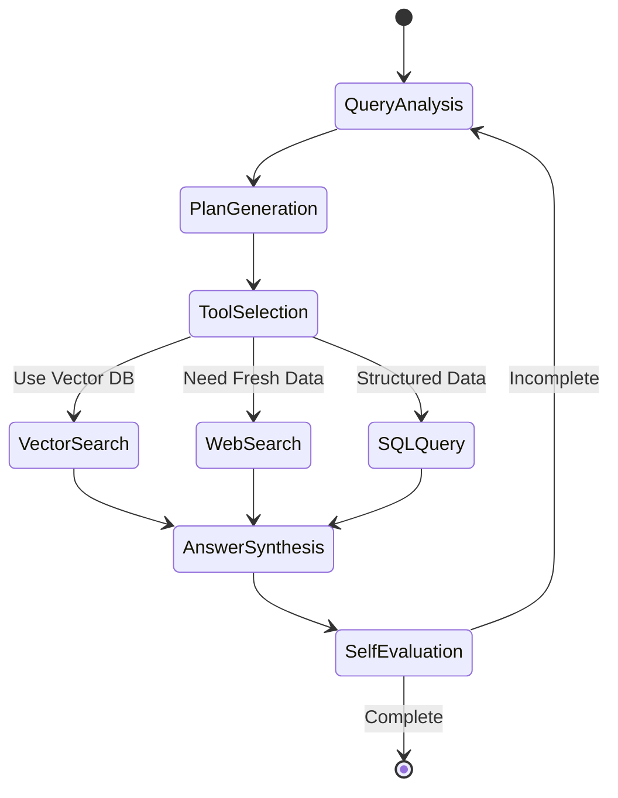

**Characteristics:**
- Agent-driven retrieval
- Multi-tool orchestration
- Iterative refinement
- Dynamic planning
- Self-correction loops

### 4. Hybrid Search Architecture

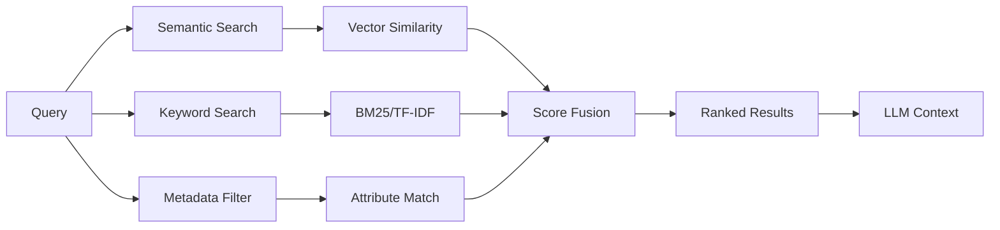

**Fusion Methods:**
- Reciprocal Rank Fusion (RRF)
- Weighted score combination
- Cascade ranking

---

## LangChain Deep Dive

### LangChain Architecture Overview

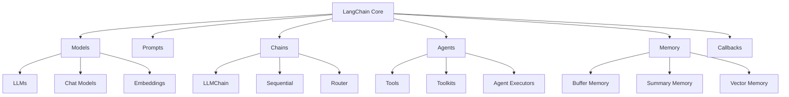

### Core LangChain Components

#### 1. Document Loaders

```python
from langchain_community.document_loaders import (
    PyPDFLoader,
    UnstructuredHTMLLoader,
    CSVLoader,
    DirectoryLoader
)

# Example: Loading documents
loader = DirectoryLoader(
    'data/',
    glob="**/*.pdf",
    loader_cls=PyPDFLoader,
    show_progress=True
)
documents = loader.load()
```

**Available Loaders:**
- PDF: PyPDFLoader, PDFPlumberLoader
- Web: WebBaseLoader, SeleniumURLLoader
- Database: SQLDatabaseLoader
- Cloud: S3DirectoryLoader, AzureBlobStorageLoader
- APIs: GitHubLoader, ConfluenceLoader

#### 2. Text Splitters

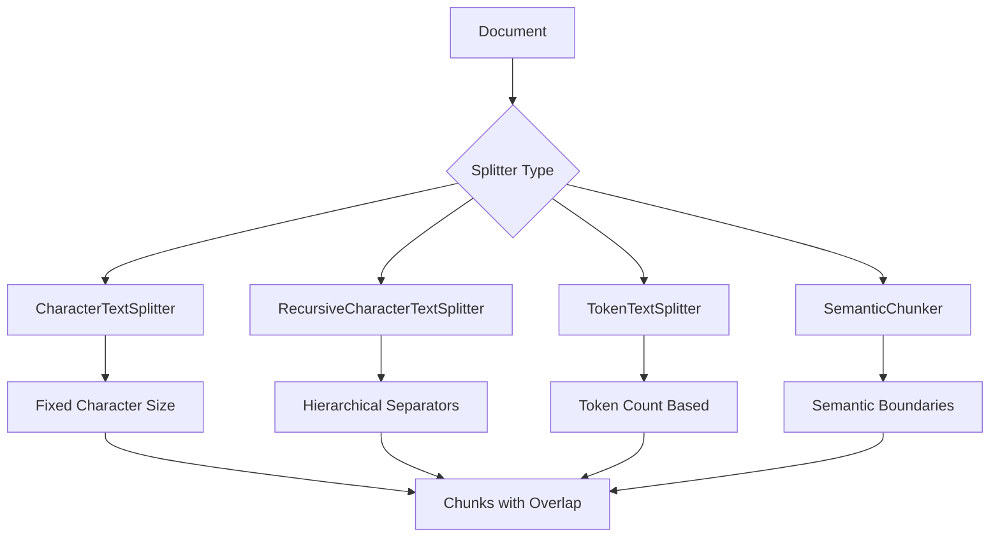

```python
from langchain.text_splitter import RecursiveCharacterTextSplitter

splitter = RecursiveCharacterTextSplitter(
    chunk_size=1000,
    chunk_overlap=200,
    length_function=len,
    separators=["\n\n", "\n", " ", ""]
)

chunks = splitter.split_documents(documents)
```

**Splitting Strategies:**
- **Character-based**: Simple, predictable
- **Token-based**: LLM-aware, better for context limits
- **Recursive**: Respects document structure
- **Semantic**: Content-aware boundaries
- **Parent-child**: Maintains document hierarchy

#### 3. Vector Stores

```python
from langchain_openai import AzureOpenAIEmbeddings
from langchain_community.vectorstores import (
    Chroma,
    FAISS,
    Pinecone,
    Qdrant,
    Weaviate
)

# Initialize embeddings
embeddings = AzureOpenAIEmbeddings(
    azure_deployment="your-embedding-deployment",
    openai_api_version="2024-02-15-preview"
)

# Create vector store
vectorstore = Chroma.from_documents(
    documents=chunks,
    embedding=embeddings,
    persist_directory="./chroma_db"
)
```

**Vector Store Comparison:**

| Store | Use Case | Strengths | Considerations |
|-------|----------|-----------|----------------|
| FAISS | Local/Prototyping | Fast, in-memory | Not distributed |
| Chroma | Development | Easy setup, persistent | Single machine |
| Pinecone | Production | Managed, scalable | Cost, vendor lock-in |
| Qdrant | Production | Open-source, filters | Self-hosted complexity |
| Weaviate | Enterprise | GraphQL, hybrid search | Learning curve |

#### 4. Retrievers

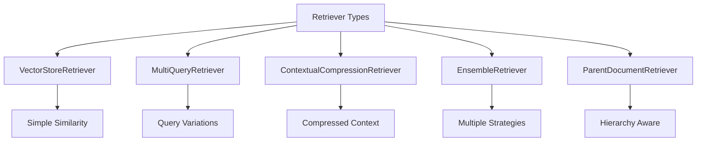

```python
from langchain.retrievers import (
    MultiQueryRetriever,
    ContextualCompressionRetriever,
    EnsembleRetriever
)
from langchain.retrievers.document_compressors import LLMChainExtractor

# Basic retriever
basic_retriever = vectorstore.as_retriever(
    search_type="similarity",
    search_kwargs={"k": 5}
)

# Multi-query retriever (generates multiple perspectives)
multi_query = MultiQueryRetriever.from_llm(
    retriever=basic_retriever,
    llm=llm
)

# Contextual compression (removes irrelevant parts)
compressor = LLMChainExtractor.from_llm(llm)
compression_retriever = ContextualCompressionRetriever(
    base_compressor=compressor,
    base_retriever=basic_retriever
)

# Ensemble retriever (combines multiple strategies)
bm25_retriever = BM25Retriever.from_documents(chunks)
ensemble = EnsembleRetriever(
    retrievers=[vectorstore.as_retriever(), bm25_retriever],
    weights=[0.7, 0.3]
)
```

#### 5. Chains

```python
from langchain.chains import (
    RetrievalQA,
    ConversationalRetrievalChain,
    LLMChain
)
from langchain_core.prompts import ChatPromptTemplate

# Simple QA chain
qa_chain = RetrievalQA.from_chain_type(
    llm=llm,
    chain_type="stuff",  # or "map_reduce", "refine", "map_rerank"
    retriever=retriever,
    return_source_documents=True
)

# Conversational chain with memory
memory = ConversationBufferMemory(
    memory_key="chat_history",
    return_messages=True
)

conversational_chain = ConversationalRetrievalChain.from_llm(
    llm=llm,
    retriever=retriever,
    memory=memory,
    verbose=True
)
```

**Chain Types Explained:**

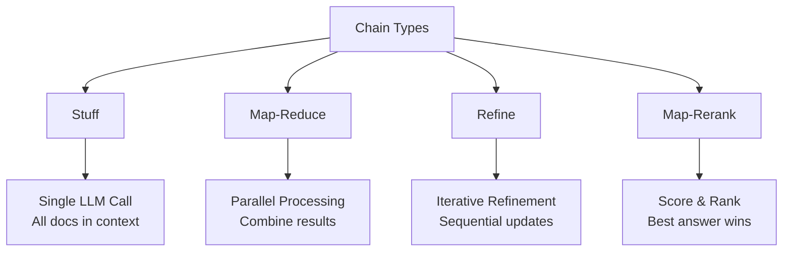

- **Stuff**: Puts all retrieved docs into prompt (best for small contexts)
- **Map-Reduce**: Processes docs in parallel, then combines (scalable)
- **Refine**: Iteratively refines answer with each doc (higher quality)
- **Map-Rerank**: Scores each doc's answer, returns best (competitive)

#### 6. Agents

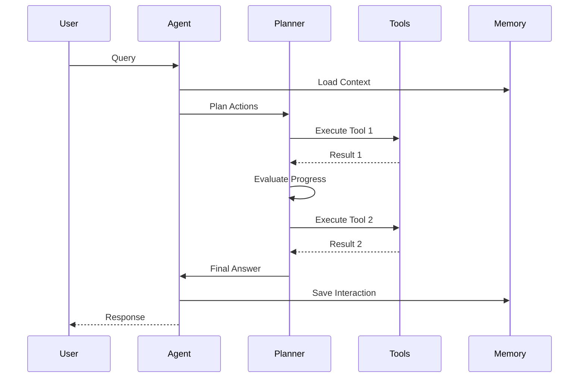

```python
from langchain.agents import (
    create_openai_tools_agent,
    AgentExecutor
)
from langchain.tools.retriever import create_retriever_tool

# Create retriever tool
retriever_tool = create_retriever_tool(
    retriever=retriever,
    name="knowledge_base",
    description="Searches company documentation. Use for questions about policies, procedures, and guidelines."
)

# Define tools
tools = [retriever_tool, other_tools...]

# Create agent
agent = create_openai_tools_agent(llm, tools, prompt)

# Create executor
agent_executor = AgentExecutor(
    agent=agent,
    tools=tools,
    verbose=True,
    max_iterations=5,
    early_stopping_method="generate"
)
```

**Agent Types:**
- **Zero-shot ReAct**: Reasons about which tool to use
- **Structured Chat**: Handles multi-input tools
- **OpenAI Functions**: Uses function calling API
- **Self-Ask with Search**: Breaks down questions iteratively
- **Plan-and-Execute**: Creates plan upfront, then executes

#### 7. Memory Systems

```python
from langchain.memory import (
    ConversationBufferMemory,
    ConversationSummaryMemory,
    ConversationBufferWindowMemory,
    VectorStoreRetrieverMemory
)

# Buffer memory (stores all messages)
buffer_memory = ConversationBufferMemory(
    memory_key="chat_history",
    return_messages=True
)

# Summary memory (summarizes old conversations)
summary_memory = ConversationSummaryMemory(
    llm=llm,
    memory_key="chat_history"
)

# Window memory (keeps last K messages)
window_memory = ConversationBufferWindowMemory(
    k=5,
    memory_key="chat_history"
)

# Vector memory (semantic search over history)
vector_memory = VectorStoreRetrieverMemory(
    retriever=vectorstore.as_retriever(search_kwargs={"k": 3})
)
```

---

## Advanced RAG Techniques

### 1. Query Transformation

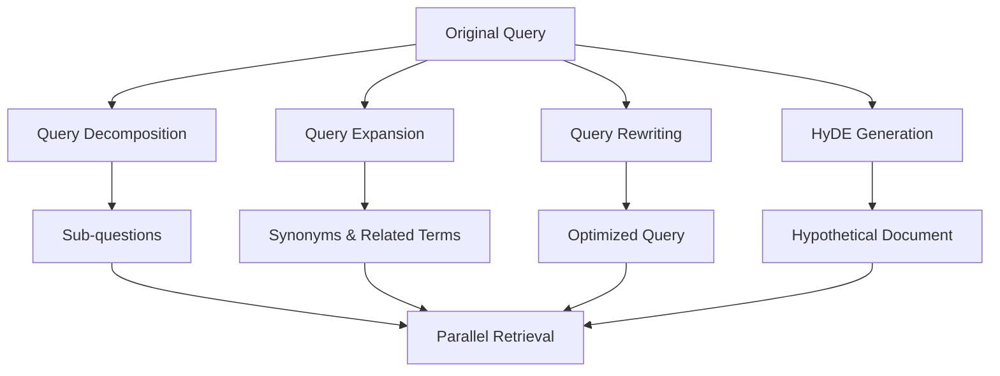

**HyDE (Hypothetical Document Embeddings):**
```python
from langchain.chains import HypotheticalDocumentEmbedder

# Generate hypothetical answer, embed it, use for search
hyde_embeddings = HypotheticalDocumentEmbedder.from_llm(
    llm=llm,
    base_embeddings=embeddings,
    prompt_key="web_search"
)

hyde_retriever = vectorstore.as_retriever(
    search_type="similarity",
    embeddings=hyde_embeddings
)
```

### 2. Reranking Strategies

```python
from langchain.retrievers.document_compressors import CohereRerank
from langchain.retrievers import ContextualCompressionRetriever

# Cohere reranker
compressor = CohereRerank(model="rerank-english-v2.0", top_n=3)

compression_retriever = ContextualCompressionRetriever(
    base_compressor=compressor,
    base_retriever=base_retriever
)
```

**Reranking Models:**
- Cohere Rerank
- Cross-Encoder models (SBERT)
- ColBERT
- Custom LLM-based reranking

### 3. Metadata Filtering

```python
# Add metadata during ingestion
for i, chunk in enumerate(chunks):
    chunk.metadata = {
        "source": doc.metadata["source"],
        "chunk_id": i,
        "category": extract_category(chunk),
        "timestamp": datetime.now().isoformat()
    }

# Filtered retrieval
retriever = vectorstore.as_retriever(
    search_type="similarity",
    search_kwargs={
        "k": 5,
        "filter": {"category": "technical_docs"}
    }
)
```

### 4. Parent Document Retrieval

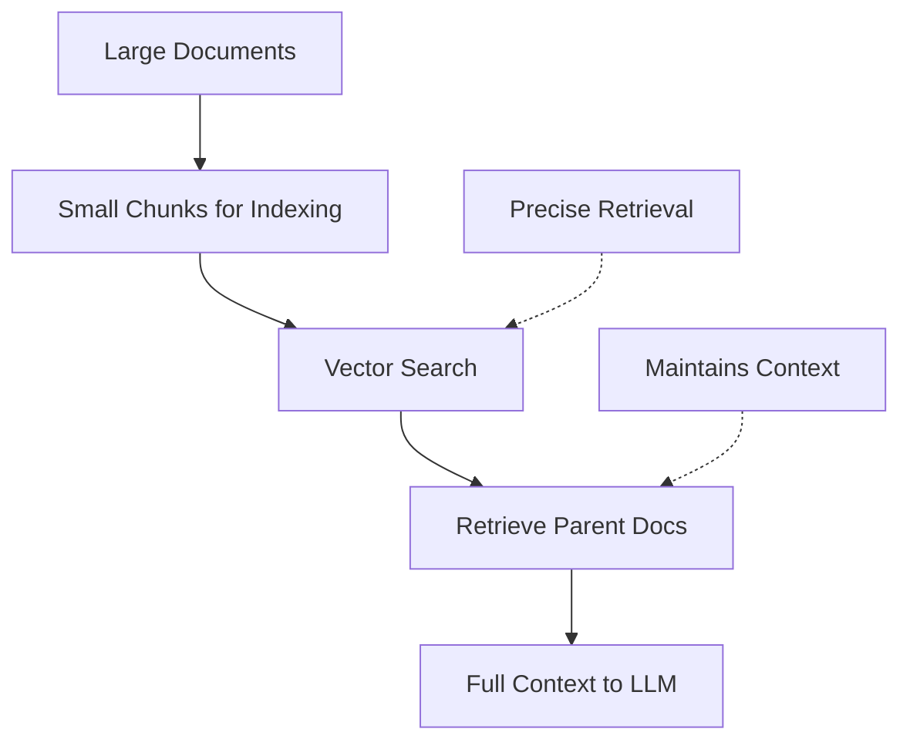

```python
from langchain.retrievers import ParentDocumentRetriever
from langchain.storage import InMemoryStore

# Child chunks for searching
child_splitter = RecursiveCharacterTextSplitter(chunk_size=400)

# Parent chunks for context
parent_splitter = RecursiveCharacterTextSplitter(chunk_size=2000)

# Storage for parent documents
store = InMemoryStore()

retriever = ParentDocumentRetriever(
    vectorstore=vectorstore,
    docstore=store,
    child_splitter=child_splitter,
    parent_splitter=parent_splitter
)
```

### 5. Self-Query Retrieval

```python
from langchain.retrievers.self_query.base import SelfQueryRetriever
from langchain.chains.query_constructor.base import AttributeInfo

# Define metadata schema
metadata_field_info = [
    AttributeInfo(
        name="category",
        description="The category of the document",
        type="string"
    ),
    AttributeInfo(
        name="year",
        description="The year the document was published",
        type="integer"
    )
]

retriever = SelfQueryRetriever.from_llm(
    llm=llm,
    vectorstore=vectorstore,
    document_contents="Technical documentation",
    metadata_field_info=metadata_field_info
)

# Handles queries like: "Documents about Python from 2023"
# Automatically extracts: filter={year: 2023}, query="Python"
```

### 6. RAPTOR (Recursive Abstractive Processing)

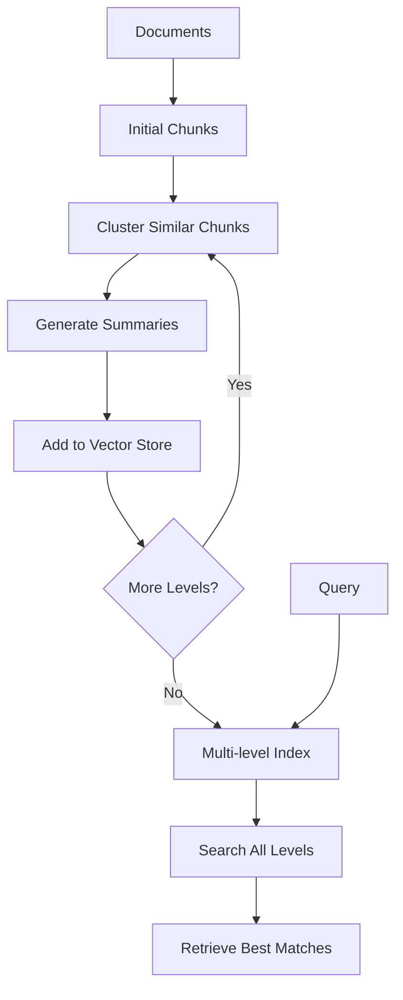

Builds a hierarchical tree of summaries for better retrieval of high-level concepts.

---

## Production Considerations

### 1. Complete RAG Pipeline Architecture

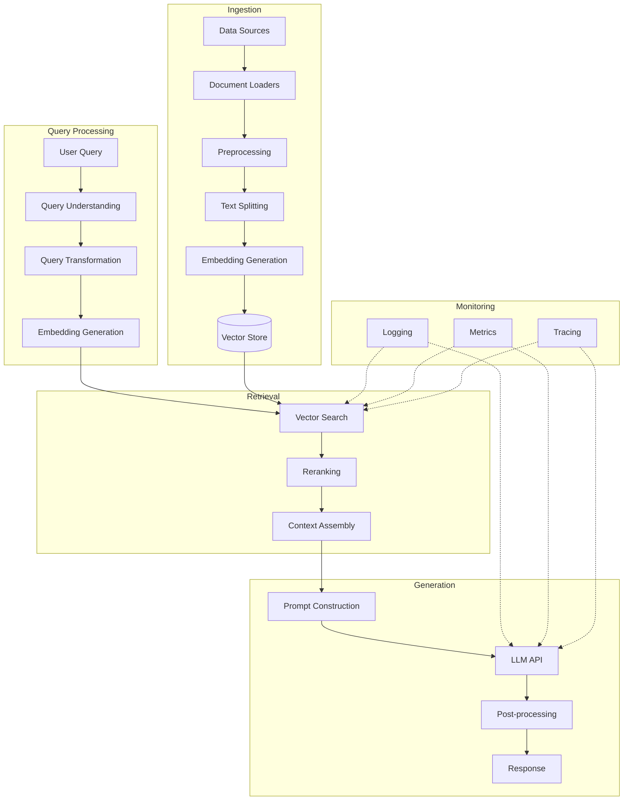

### 2. Scaling Considerations

**Vector Store Selection:**
```python
# Development: FAISS
vectorstore = FAISS.from_documents(docs, embeddings)

# Production: Managed service
import pinecone
pinecone.init(api_key="...", environment="...")
vectorstore = Pinecone.from_documents(docs, embeddings, index_name="prod")

# Self-hosted: Qdrant
from qdrant_client import QdrantClient
client = QdrantClient(url="http://qdrant:6333")
vectorstore = Qdrant(client, collection_name="docs", embeddings=embeddings)
```

**Performance Optimization:**
- Batch embedding generation
- Connection pooling for vector stores
- Caching frequent queries
- Async operations where possible
- Response streaming

### 3. Evaluation Framework

```python
from langchain.evaluation import (
    load_evaluator,
    EvaluatorType
)

# Retrieval evaluation
retrieval_eval = load_evaluator(
    EvaluatorType.EMBEDDING_DISTANCE,
    embeddings=embeddings
)

# Answer relevance
relevance_eval = load_evaluator(
    EvaluatorType.QA,
    llm=llm
)

# Faithfulness (answer grounded in context)
faithfulness_eval = load_evaluator(
    EvaluatorType.CRITERIA,
    criteria="faithfulness",
    llm=llm
)
```

**Key Metrics:**
- Retrieval: Precision@K, Recall@K, MRR, NDCG
- Generation: BLEU, ROUGE, BERTScore
- End-to-end: Answer relevance, Faithfulness, Helpfulness
- Operational: Latency, Cost per query, Cache hit rate

### 4. Monitoring & Observability

```python
from langchain.callbacks import LangChainTracer
from langchain.callbacks.manager import CallbackManager

# LangSmith tracing
tracer = LangChainTracer(project_name="rag-production")
callback_manager = CallbackManager([tracer])

# Custom callback for monitoring
class MetricsCallback(BaseCallbackHandler):
    def on_retriever_start(self, query, **kwargs):
        log_metric("retrieval.started", query)
    
    def on_retriever_end(self, documents, **kwargs):
        log_metric("retrieval.docs_retrieved", len(documents))
    
    def on_llm_start(self, prompts, **kwargs):
        log_metric("llm.tokens_sent", count_tokens(prompts))
    
    def on_llm_end(self, response, **kwargs):
        log_metric("llm.tokens_received", count_tokens(response))
```

### 5. Error Handling & Resilience

```python
from tenacity import retry, stop_after_attempt, wait_exponential

class RobustRAGChain:
    @retry(
        stop=stop_after_attempt(3),
        wait=wait_exponential(multiplier=1, min=4, max=10)
    )
    def retrieve_with_retry(self, query):
        try:
            return self.retriever.get_relevant_documents(query)
        except Exception as e:
            logger.error(f"Retrieval failed: {e}")
            # Fallback to keyword search
            return self.fallback_retriever.get_relevant_documents(query)
    
    def generate_with_fallback(self, query, context):
        try:
            return self.primary_llm.invoke(query, context)
        except RateLimitError:
            logger.warning("Rate limited, using backup model")
            return self.backup_llm.invoke(query, context)
        except Exception as e:
            logger.error(f"Generation failed: {e}")
            return self.generate_fallback_response(query)
```

### 6. Security Best Practices

```python
# Input validation
def sanitize_query(query: str) -> str:
    # Remove potential prompt injections
    # Limit length
    # Validate encoding
    return validated_query

# Output filtering
def filter_sensitive_data(response: str) -> str:
    # Remove PII
    # Filter confidential patterns
    # Apply content policy
    return filtered_response

# Access control
def check_user_permissions(user_id: str, document: Document) -> bool:
    return document.metadata.get("allowed_users") and \
           user_id in document.metadata["allowed_users"]
```

---

## Learning Resources

### Official Documentation
- **LangChain Docs**: https://python.langchain.com/docs/get_started/introduction
- **LangChain Cookbook**: https://github.com/langchain-ai/langchain/tree/master/cookbook
- **Azure OpenAI Service**: https://learn.microsoft.com/en-us/azure/ai-services/openai/
- **LangSmith (Observability)**: https://docs.smith.langchain.com/

### Essential Papers
1. **RAG Original Paper**: "Retrieval-Augmented Generation for Knowledge-Intensive NLP Tasks" (Lewis et al., 2020)
   - https://arxiv.org/abs/2005.11401

2. **RAPTOR**: "RAPTOR: Recursive Abstractive Processing for Tree-Organized Retrieval" (Sarthi et al., 2024)
   - https://arxiv.org/abs/2401.18059

3. **Self-RAG**: "Self-RAG: Learning to Retrieve, Generate, and Critique through Self-Reflection" (Asai et al., 2023)
   - https://arxiv.org/abs/2310.11511

4. **HyDE**: "Precise Zero-Shot Dense Retrieval without Relevance Labels" (Gao et al., 2022)
   - https://arxiv.org/abs/2212.10496

### Video Courses
- **DeepLearning.AI - LangChain for LLM Application Development**: https://www.deeplearning.ai/short-courses/langchain-for-llm-application-development/
- **LangChain Full Course**: https://www.youtube.com/watch?v=lG7Uxts9SXs (freeCodeCamp)
- **Advanced RAG Techniques**: https://www.deeplearning.ai/short-courses/advanced-retrieval-for-ai/

### GitHub Repositories
- **LangChain**: https://github.com/langchain-ai/langchain
- **LlamaIndex** (Alternative framework): https://github.com/run-llama/llama_index
- **RAG Techniques Examples**: https://github.com/langchain-ai/langchain/tree/master/templates
- **Production RAG Template**: https://github.com/langchain-ai/langserve

### Blogs & Tutorials
- **Pinecone Learning Center**: https://www.pinecone.io/learn/
  - Excellent RAG tutorials and vector search guides
- **LangChain Blog**: https://blog.langchain.dev/
- **Weaviate Blog**: https://weaviate.io/blog
- **Towards Data Science - RAG Articles**: Search for "RAG" tag

### Tools & Libraries
- **Vector Databases**:
  - Pinecone: https://www.pinecone.io/
  - Qdrant: https://qdrant.tech/
  - Weaviate: https://weaviate.io/
  - Chroma: https://www.trychroma.com/
  - Milvus: https://milvus.io/

- **Embedding Models**:
  - OpenAI Embeddings: https://platform.openai.com/docs/guides/embeddings
  - Sentence Transformers: https://www.sbert.net/
  - Cohere Embed: https://cohere.com/embed

- **Evaluation**:
  - RAGAS: https://github.com/explodinggradients/ragas
  - TruLens: https://www.trulens.org/

### Community & Support
- **LangChain Discord**: https://discord.gg/langchain
- **r/LangChain**: https://www.reddit.com/r/LangChain/
- **Stack Overflow**: Tag `langchain`

### Practical Projects to Build
1. **Document Q&A System**: Build a RAG system over your company's internal docs
2. **Code Assistant**: Create a retrieval system over your codebase
3. **Research Assistant**: Multi-source RAG combining papers, web, and databases
4. **Conversational Agent**: Memory-enabled chatbot with knowledge retrieval
5. **Multi-modal RAG**: Combine text, images, and structured data

### Advanced Topics to Explore
- **Fine-tuning embeddings** for domain-specific retrieval
- **Prompt compression** techniques (LongLLMLingua)
- **Multi-vector retrieval** (ColBERT, late interaction)
- **Graph RAG**: Combining knowledge graphs with vector search
- **Temporal RAG**: Handling time-sensitive information
- **Multi-lingual RAG**: Cross-language retrieval and generation

---

## Quick Start Code Template

```python
from langchain_openai import AzureChatOpenAI, AzureOpenAIEmbeddings
from langchain_community.vectorstores import Chroma
from langchain.text_splitter import RecursiveCharacterTextSplitter
from langchain.chains import ConversationalRetrievalChain
from langchain.memory import ConversationBufferMemory
from langchain_community.document_loaders import DirectoryLoader

# 1. Initialize Azure OpenAI
llm = AzureChatOpenAI(
    azure_deployment="your-chat-deployment",
    openai_api_version="2024-02-15-preview",
    temperature=0
)

embeddings = AzureOpenAIEmbeddings(
    azure_deployment="your-embedding-deployment",
    openai_api_version="2024-02-15-preview"
)

# 2. Load and process documents
loader = DirectoryLoader('data/', glob="**/*.pdf")
documents = loader.load()

text_splitter = RecursiveCharacterTextSplitter(
    chunk_size=1000,
    chunk_overlap=200
)
chunks = text_splitter.split_documents(documents)

# 3. Create vector store
vectorstore = Chroma.from_documents(
    documents=chunks,
    embedding=embeddings,
    persist_directory="./chroma_db"
)

# 4. Create retriever
retriever = vectorstore.as_retriever(
    search_type="similarity",
    search_kwargs={"k": 5}
)

# 5. Set up memory
memory = ConversationBufferMemory(
    memory_key="chat_history",
    return_messages=True,
    output_key="answer"
)

# 6. Create RAG chain
qa_chain = ConversationalRetrievalChain.from_llm(
    llm=llm,
    retriever=retriever,
    memory=memory,
    return_source_documents=True,
    verbose=True
)

# 7. Use the chain
response = qa_chain({"question": "What is the return policy?"})
print(f"Answer: {response['answer']}")
print(f"Sources: {[doc.metadata['source'] for doc in response['source_documents']]}")
```

---

## Next Steps

Given your 20+ years of experience, I'd recommend:

1. **Start with basics**: Build a simple RAG system using the quick start template above
2. **Experiment with retrievers**: Try different retrieval strategies (multi-query, compression, ensemble)
3. **Implement evaluation**: Set up metrics early to measure improvement
4. **Scale gradually**: Start with FAISS, move to production vector stores
5. **Explore agents**: Combine RAG with tool-using agents for complex workflows
6. **Optimize for production**: Focus on latency, cost, and observability

The field is evolving rapidly, so stay engaged with the community and keep experimenting!
